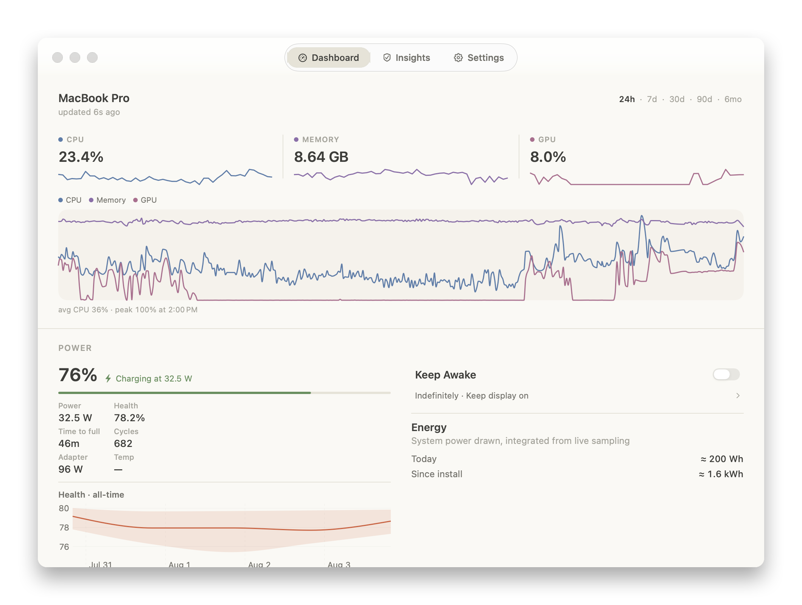
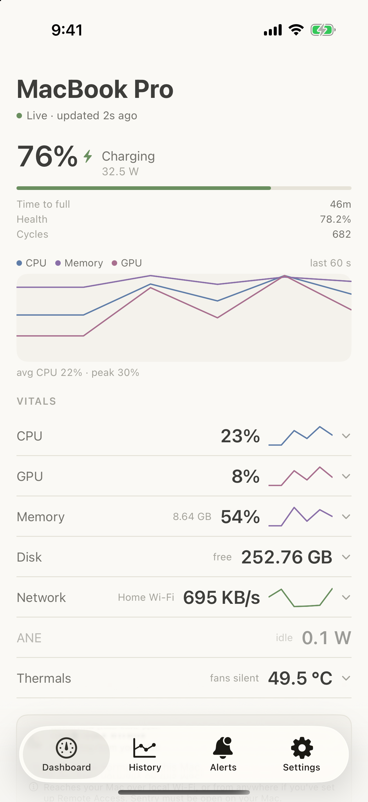
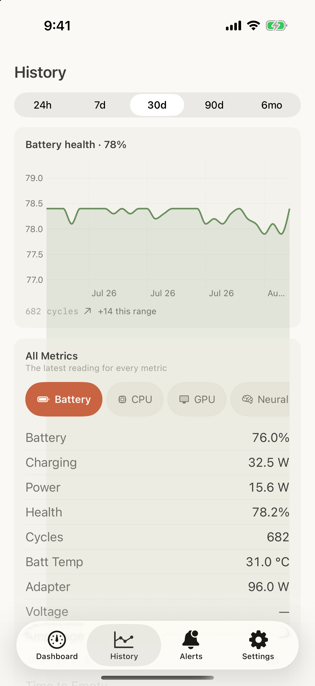
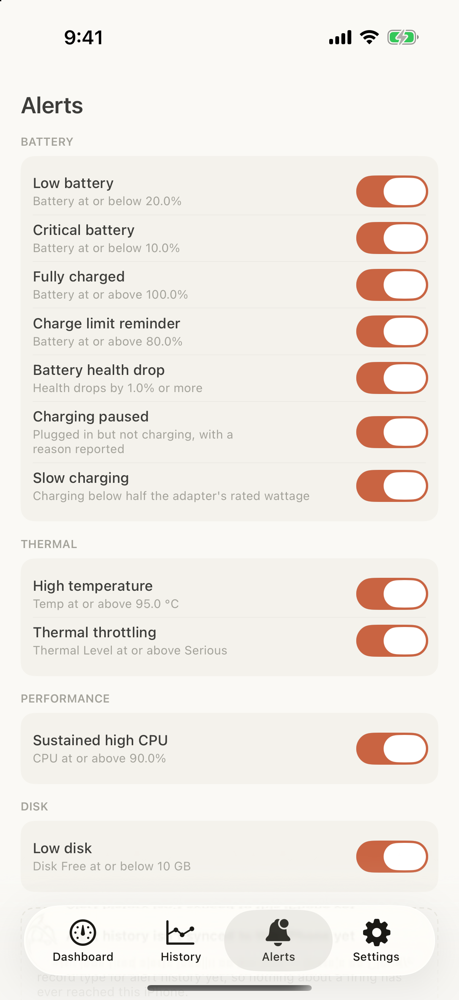
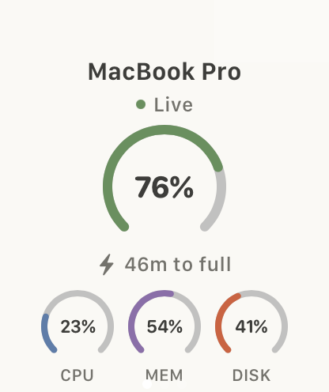
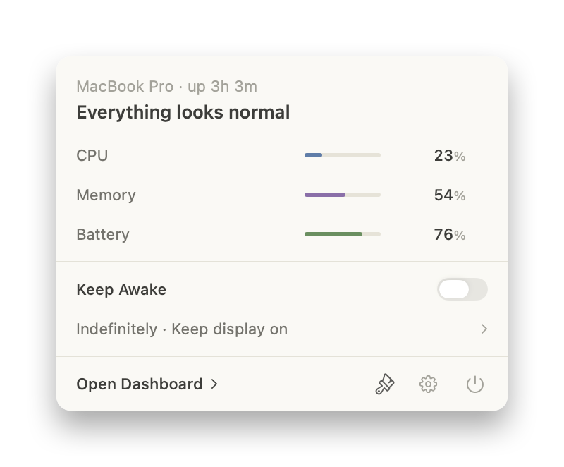

# Sentry

A macOS menu bar system monitor with iPhone and Apple Watch companions,
remote access over the local network or a VPN, sleep-prevention control from
any of the three, and an AI-agent (MCP) integration layer.

By Malek Swilam & Aniketh Bandlamudi.

Private / proprietary — all rights reserved. Not licensed for reuse; see
[`LICENSE`](LICENSE). Bundled open-source dependencies are acknowledged in
[`docs/third-party-licenses.md`](docs/third-party-licenses.md).

<p align="center">
  
</p>

<p align="center">
  &nbsp;
  &nbsp;
  
</p>

<p align="center">
  &nbsp;&nbsp;&nbsp;
  
</p>

## What it does

**On the Mac** — a menu bar readout (monochrome, layout-configurable) with a
themed dropdown; a Dashboard of live charts backed by a GRDB history store
with tiered rollups; Protection Insights (battery health trend with a
degradation ETA, thermal cool-down estimates, energy use in kWh by day /
week / month); alert rules with history; keep-awake with process-aware mode
(hold until a named process exits); fan RPM readout everywhere and real fan
*control* on Apple Silicon behind an explicitly-installed root helper
(`SentryFanDaemon` — SMC writes live in that binary and nowhere else); a
custom theme editor with WCAG contrast checking on top of 15 built-in
themes.

**Companions** — an iPhone app and a three-page Watch app (overview,
keep-awake, agent activity — with a kill-switch resume path and its own Siri
intents), both fed over local-network sync (Bonjour) and, away from home, a
TLS-PSK listener the user pairs with a QR code. Reconnection is
keepalive-backed and sleep/wake-aware, and reconnects prefer the
last-connected Mac rather than whichever one answers first. There is
deliberately **no cloud**: your Mac's data goes to your phone and your
watch, never to a server. Shortcuts/Siri work locally, in-process, with no
network hop.

**Keep-awake** goes beyond a duration: conditional release (battery below
%, sustained CPU above %, while a named app or process runs, while a
download is active, on a schedule) — `PowerControlService`'s
`ReleaseCondition`.

**For agents and scripts** — an MCP server in two transports (stdio via
`SentryMCP` for Claude Desktop/Code/Cursor; optional LAN HTTP gated by an
API key), with per-tool toggles, **per-client** rate limiting, and
confirmation gates on write tools, all in Settings ▸ AI Access. Past
permissions, this is a real agent *manager*: `preflight_check` returns a
structured proceed/caution/wait/do-not-start verdict with reasons and a
wait estimate before an agent starts heavy work; `get_agent_capacity` shows
what other sessions are active so two agents don't contend; per-session
resource attribution (`get_session_resource_report`) reports what a
session actually cost in battery, thermals, and awake time; guardrails
(battery floor, quiet hours, thermal auto-revoke) and a kill switch —
global or per-client — keep an agent from running the Mac hot while nobody's
watching, including `CaffeinateArbitrator`'s enforcement against a coding
agent's own external `caffeinate` process, not just Sentry's own keep-awake.
The `sentryctl` CLI (`check`, `wait`, `status`, `sessions`, `stop
<client>`, `session-report`, streaming `watch`, `statusline` for
tmux/Starship prompts, `hook pretooluse` for Claude Code's `PreToolUse`
gate) mirrors the same controls from the shell — including a packaged
Claude Code plugin bundle (MCP registration, the hook, and a
`subagentStatusLine` script) under
[`integrations/claude-code/plugin/`](integrations/claude-code/plugin/README.md).
Copy-pasteable configs live in
[`docs/integrations/`](docs/integrations/README.md).

## Installing

Sentry ships outside the Mac App Store as a notarized DMG. That's forced,
not chosen: the app reads `libIOReport.dylib` and the private
`IOHIDEventSystemClient` API, neither of which exists inside the App
Sandbox the App Store requires. Grab the DMG from Releases when published,
or build from source below.

The iPhone and Watch apps install together — the watch app is embedded in
the iPhone app. Open Sentry on the iPhone while the Mac app is running on
the same Wi-Fi and they find each other over Bonjour; pairing for
away-from-home access is a QR code in Settings ▸ Sync on the Mac.

## Building

The Xcode project is generated from [`project.yml`](project.yml) via
[XcodeGen](https://github.com/yonaskolb/XcodeGen) — `Sentry.xcodeproj` itself
is not committed, so text diffs stay reviewable.

```sh
brew install xcodegen   # once
xcodegen generate       # after cloning, or after editing project.yml
open Sentry.xcodeproj
```

Or build, install to /Applications, and (re)launch in one step:

```sh
./run.sh
```

Keep clones **outside iCloud-synced folders** (e.g. `~/Developer`, not
`~/Documents`): iCloud's FileProvider xattrs break codesign, its eviction
breaks git under disk pressure, and both have burned real hours here.
Derived data should also live outside the repo; `run.sh` handles this and
resolves `DEVELOPER_DIR` itself (preferring Xcode-beta if installed).

Targets: `Sentry` (menu bar app, builds `Sentry.app`), `SentryKit` (shared
models/services; separate macOS, iOS, and watchOS variants), `SystemMetricsKit`
(macOS collectors), `SentryMobile` (iOS companion), `SentryWatch` (watchOS
app) and `SentryWatchWidgetExtension` (complication),
`SentryWidgetExtension` (iOS home/lock-screen widget),
`SentryWidgetExtension_macOS` (desktop widget, fed live by the menu bar
app), `SentryMCP` (MCP stdio server), `SentryCLI` (builds `sentryctl`),
`SentryFanDaemon` (root fan helper), `SentryTests`.

Debug builds need no certificates at all; the strict Developer ID settings
are scoped to the Release configuration via the `DeveloperIDSigned` target
template in `project.yml`.

> Desktop widgets note: the macOS widget builds and is embedded, but macOS
> only lists widgets from apps signed with a real team identity. Add an
> Apple ID in Xcode → Settings → Accounts and set it as the project's team
> to make the widget appear in the gallery.

## Using the CLI and MCP

`SentryMCP` and `sentryctl` are copied into `Sentry.app/Contents/MacOS/` —
they link `SentryKit.framework` and can only resolve it from inside the
bundle, so that is where to invoke them from:
`/Applications/Sentry.app/Contents/MacOS/sentryctl check`.

Both reach the app over an XPC Mach service, brokered by a bundled
LaunchAgent registered from Settings ▸ AI Access ▸ Command-Line Access
(code-signature peer verification, `SentryMCPBridge`). Registration needs a
real code signature — on an ad-hoc-signed debug build, `SMAppService`
refuses and the tools fail with an error naming exactly that.
[`docs/integrations/README.md`](docs/integrations/README.md) documents the
one-time enable step and has copy-pasteable configs for Claude Desktop,
Claude Code, and Cursor.

## Releasing

```sh
scripts/release.sh                  # archive → export → verify → dmg → notarize → staple
scripts/release.sh --skip-notarize  # everything up to submission
```

Prerequisites (a `Developer ID Application` certificate, `create-dmg`, and a
stored `notarytool` credential) are listed in that script's header, and it
refuses to start until all of them are present. Launch-readiness work is
tracked in [`PROGRESS.md`](PROGRESS.md).
